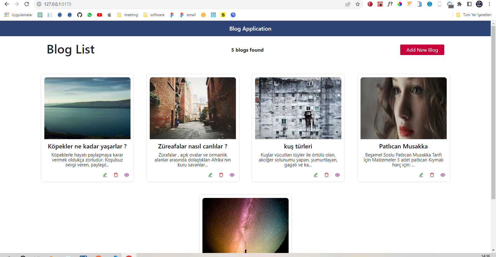

# blog_app
This is blog web application created with golang , fiber , gorm , react

## TO-DO
- [ ] custom loading hook
- [ ] add loading to detail page
- [ ] dinamic img adding with backend
- [ ] show notification after create update and delete operations
- [ ] add back to home button create , update and detail page
- [ ] fix repating css code
- [ ] make application responsive for mobile and desktop
- [ ] add searchbar to homapage  for seaarching blog from bloglist
- [ ] add copy button for blog link. it is for sharing blog link  anybody
- [ ] add topic , author , create and update time area.

